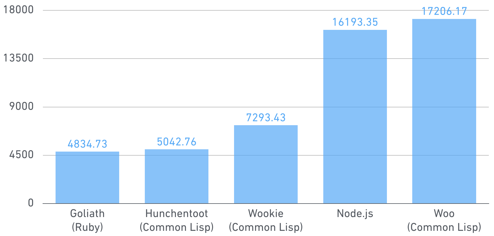
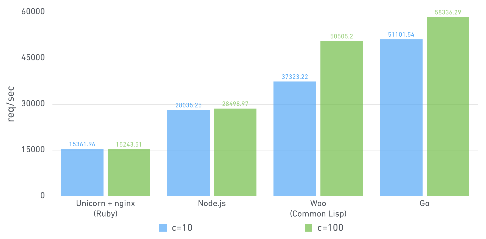

# Benchmarks

Comparison of the server performance to return "Hello, World" for every requests. Here's the results of requests/sec scores.



Here's the new graph when using multiple CPU cores:



All benchmarks were done with the below command of [wrk](https://github.com/wg/wrk).

```
wrk -c [10 or 100] -t 4 -d 10 http://127.0.0.1:5000
```

The benchmarking environment is:

* Sakura VPS 16GB (CPU: 8 Core / Memory: 16GB)
* Ubuntu 16.04.2 LTS (GNU/Linux 4.4.0-36-generic)
* wrk 4.0.0
* nginx 1.10.0
* Python 2.7.12
* PyPy 5.1.2
* Tornado 4.4.1
* SBCL 1.3.9
* Quicklisp 2016-08-25
* Node.js 4.2.6
* Go 1.6.2
* Racket 6.12
* Ruby 2.3.1p112
* Unicorn 5.1.0
* libuv 1.8.0
* libev 4.22

```
$ cat /proc/version
Linux version 4.4.0-36-generic (buildd@lcy01-01) (gcc version 5.4.0 20160609 (Ubuntu 5.4.0-6ubuntu1~16.04.2) ) #55-Ubuntu SMP Thu Aug 11 18:01:55 UTC 2016
$ sudo apt-get install wrk nginx python2.7 python-pip pypy nodejs golang racket ruby ruby-dev libuv1-dev libev-dev
$ sudo apt-get install -y autotools-dev automake libcurl4-gnutls-dev curl make
$ pip install tornado
$ sudo gem install unicorn rack
```

## Wookie (Common Lisp)

```
$ benchmark/run-benchmark benchmark/wookie/run
```

```
Running 10s test @ http://127.0.0.1:5000
  4 threads and 10 connections
  Thread Stats   Avg      Stdev     Max   +/- Stdev
    Latency     2.28ms    1.47ms  35.53ms   95.53%
    Req/Sec     0.93k    73.03     1.11k    75.25%
  37105 requests in 10.01s, 2.69MB read
Requests/sec:   3707.70
Transfer/sec:    275.18KB
```

```
Running 10s test @ http://127.0.0.1:5000
  4 threads and 100 connections
  Thread Stats   Avg      Stdev     Max   +/- Stdev
    Latency    27.57ms    4.48ms  82.00ms   84.93%
    Req/Sec     0.91k   131.34     1.77k    65.50%
  36332 requests in 10.03s, 2.63MB read
Requests/sec:   3622.04
Transfer/sec:    268.82KB
```

## Tornado (Python)

```
$ benchmark/run-benchmark python2.7 benchmark/tornado/run
```

```
Running 10s test @ http://127.0.0.1:5000
  4 threads and 10 connections
  Thread Stats   Avg      Stdev     Max   +/- Stdev
    Latency     3.70ms  195.32us   6.61ms   93.77%
    Req/Sec   542.43     16.24   626.00     52.75%
  21605 requests in 10.01s, 4.27MB read
Requests/sec:   2157.56
Transfer/sec:    436.15KB
```

```
Running 10s test @ http://127.0.0.1:5000
  4 threads and 100 connections
  Thread Stats   Avg      Stdev     Max   +/- Stdev
    Latency    47.30ms    2.72ms  80.61ms   95.09%
    Req/Sec   529.76     61.37   696.00     84.25%
  21100 requests in 10.04s, 4.17MB read
Requests/sec:   2102.45
Transfer/sec:    425.01KB
```

## Hunchentoot (Common Lisp)

```
$ benchmark/run-benchmark benchmark/hunchentoot/run
```

```
Running 10s test @ http://127.0.0.1:5000
  4 threads and 10 connections
  Thread Stats   Avg      Stdev     Max   +/- Stdev
    Latency     1.80ms  692.10us  15.53ms   98.18%
    Req/Sec     1.12k    67.36     1.17k    92.52%
  44589 requests in 10.10s, 7.48MB read
Requests/sec:   4414.92
Transfer/sec:    758.81KB
```

```
Running 10s test @ http://127.0.0.1:5000
  4 threads and 100 connections
  Thread Stats   Avg      Stdev     Max   +/- Stdev
    Latency    28.87ms   93.72ms   1.61s    95.60%
    Req/Sec     1.10k   275.26     1.74k    73.44%
  40945 requests in 10.03s, 6.87MB read
  Socket errors: connect 0, read 0, write 0, timeout 3
Requests/sec:   4082.88
Transfer/sec:    701.74KB
```

## Tornado (PyPy)

```
$ benchmark/run-benchmark pypy benchmark/tornado/run
```

```
Running 10s test @ http://127.0.0.1:5000
  4 threads and 10 connections
  Thread Stats   Avg      Stdev     Max   +/- Stdev
    Latency   706.99us  500.39us  15.64ms   99.32%
    Req/Sec     2.94k   132.70     3.51k    92.80%
  117746 requests in 10.10s, 23.24MB read
Requests/sec:  11657.78
Transfer/sec:      2.30MB
```

```
Running 10s test @ http://127.0.0.1:5000
  4 threads and 100 connections
  Thread Stats   Avg      Stdev     Max   +/- Stdev
    Latency     9.42ms    1.78ms  45.47ms   96.15%
    Req/Sec     2.68k   256.60     3.01k    88.25%
  106610 requests in 10.02s, 21.05MB read
Requests/sec:  10636.27
Transfer/sec:      2.10MB
```

## Node.js http module

```
$ benchmark/run-benchmark benchmark/node/run
```

```
Running 10s test @ http://127.0.0.1:5000
  4 threads and 10 connections
  Thread Stats   Avg      Stdev     Max   +/- Stdev
    Latency   655.88us   58.56us   3.40ms   96.02%
    Req/Sec     3.06k    76.70     3.18k    81.93%
  122947 requests in 10.10s, 15.24MB read
Requests/sec:  12173.13
Transfer/sec:      1.51MB
```

```
Running 10s test @ http://127.0.0.1:5000
  4 threads and 100 connections
  Thread Stats   Avg      Stdev     Max   +/- Stdev
    Latency     8.33ms  648.44us  20.02ms   90.64%
    Req/Sec     3.02k   191.95     3.79k    72.25%
  120074 requests in 10.02s, 14.89MB read
Requests/sec:  11984.32
Transfer/sec:      1.49MB
```

## Woo (Common Lisp)

```
$ benchmark/run-benchmark benchmark/woo/run
```

```
Running 10s test @ http://127.0.0.1:5000
  4 threads and 10 connections
  Thread Stats   Avg      Stdev     Max   +/- Stdev
    Latency   298.09us  280.55us  11.49ms   99.22%
    Req/Sec     7.10k   595.38    15.62k    85.29%
  283126 requests in 10.10s, 35.10MB read
Requests/sec:  28032.34
Transfer/sec:      3.48MB
```

```
Running 10s test @ http://127.0.0.1:5000
  4 threads and 100 connections
  Thread Stats   Avg      Stdev     Max   +/- Stdev
    Latency     2.60ms  594.86us  17.18ms   96.36%
    Req/Sec     9.71k   715.15    15.16k    76.25%
  386785 requests in 10.02s, 47.95MB read
Requests/sec:  38591.20
Transfer/sec:      4.78MB
```

## Go

```
$ benchmark/run-benchmark benchmark/go/run
```

```
Running 10s test @ http://127.0.0.1:5000
  4 threads and 10 connections
  Thread Stats   Avg      Stdev     Max   +/- Stdev
    Latency     1.09ms    7.09ms 111.96ms   98.27%
    Req/Sec     7.89k     1.75k   21.69k    96.27%
  315671 requests in 10.10s, 38.84MB read
Requests/sec:  31253.92
Transfer/sec:      3.84MB
```

```
Running 10s test @ http://127.0.0.1:5000
  4 threads and 100 connections
  Thread Stats   Avg      Stdev     Max   +/- Stdev
    Latency     3.24ms    1.86ms  20.24ms   62.52%
    Req/Sec     7.82k     1.05k   27.62k    98.50%
  312051 requests in 10.10s, 38.39MB read
Requests/sec:  30897.12
Transfer/sec:      3.80MB
```

## Hunchentoot (multi-threaded-taskmaster)

```
$ benchmark/run-benchmark benchmark/hunchentoot/run true
```

```
Running 10s test @ http://127.0.0.1:5000
  4 threads and 10 connections
  Thread Stats   Avg      Stdev     Max   +/- Stdev
    Latency   574.56us    2.16ms  50.15ms   96.26%
    Req/Sec     7.38k     1.19k   10.46k    69.23%
  295875 requests in 10.10s, 44.30MB read
Requests/sec:  29294.85
Transfer/sec:      4.39MB
```

```
Running 10s test @ http://127.0.0.1:5000
  4 threads and 100 connections
  Thread Stats   Avg      Stdev     Max   +/- Stdev
    Latency    12.36ms   52.93ms 943.13ms   97.07%
    Req/Sec     8.13k     3.31k   19.63k    69.21%
  322897 requests in 10.09s, 48.35MB read
Requests/sec:  32007.10
Transfer/sec:      4.79MB
```

## Unicorn + nginx (Ruby, worker_processes=4)

nginx's worker\_processes=4
Unicorn's worker\_processes=4

```
$ sudo nginx -c $PWD/benchmark/unicorn/nginx.conf
$ benchmark/run-benchmark benchmark/unicorn/run
```

```
Running 10s test @ http://127.0.0.1:5000
  4 threads and 10 connections
  Thread Stats   Avg      Stdev     Max   +/- Stdev
    Latency   220.02us  260.33us  11.86ms   98.23%
    Req/Sec     9.67k     1.22k   12.66k    70.90%
  386771 requests in 10.10s, 59.37MB read
Requests/sec:  38294.10
Transfer/sec:      5.88MB
```

```
Running 10s test @ http://127.0.0.1:5000
  4 threads and 100 connections
  Thread Stats   Avg      Stdev     Max   +/- Stdev
    Latency     1.63ms    3.35ms 103.23ms   98.31%
    Req/Sec    18.58k     6.26k   42.99k    72.50%
  740129 requests in 10.04s, 113.61MB read
Requests/sec:  73711.39
Transfer/sec:     11.31MB
```

## Node.js http module (4 cluster)

```
$ benchmark/run-benchmark benchmark/node/run 4
```

```
Running 10s test @ http://127.0.0.1:5000
  4 threads and 10 connections
  Thread Stats   Avg      Stdev     Max   +/- Stdev
    Latency   200.97us  487.76us  27.56ms   99.33%
    Req/Sec    11.07k     1.42k   21.98k    85.54%
  441803 requests in 10.10s, 54.77MB read
Requests/sec:  43744.19
Transfer/sec:      5.42MB
```

```
Running 10s test @ http://127.0.0.1:5000
  4 threads and 100 connections
  Thread Stats   Avg      Stdev     Max   +/- Stdev
    Latency     2.05ms  417.67us  21.24ms   86.82%
    Req/Sec    12.25k   729.79    20.32k    75.50%
  487426 requests in 10.04s, 60.43MB read
Requests/sec:  48546.08
Transfer/sec:      6.02MB
```

## Woo (Common Lisp, worker-num=4)

```
$ benchmark/run-benchmark benchmark/woo/run 4
```

```
Running 10s test @ http://127.0.0.1:5000
  4 threads and 10 connections
  Thread Stats   Avg      Stdev     Max   +/- Stdev
    Latency   323.90us    2.25ms  54.48ms   98.25%
    Req/Sec    16.33k     1.71k   20.82k    80.20%
  656401 requests in 10.10s, 81.38MB read
Requests/sec:  64989.82
Transfer/sec:      8.06MB
```

```
Running 10s test @ http://127.0.0.1:5000
  4 threads and 100 connections
  Thread Stats   Avg      Stdev     Max   +/- Stdev
    Latency     1.12ms    1.38ms  21.69ms   95.08%
    Req/Sec    27.85k     2.26k   36.49k    70.75%
  1108090 requests in 10.03s, 137.38MB read
Requests/sec: 110528.03
Transfer/sec:     13.70MB
```

## Go (GOMAXPROCS=4)

```
$ benchmark/run-benchmark benchmark/go/run 4
```

```
Running 10s test @ http://127.0.0.1:5000
  4 threads and 10 connections
  Thread Stats   Avg      Stdev     Max   +/- Stdev
    Latency   112.86us  511.71us  19.42ms   99.11%
    Req/Sec    24.50k     2.75k   31.57k    68.56%
  984705 requests in 10.08s, 121.14MB read
Requests/sec:  97647.04
Transfer/sec:     12.01MB
```

```
Running 10s test @ http://127.0.0.1:5000
  4 threads and 100 connections
  Thread Stats   Avg      Stdev     Max   +/- Stdev
    Latency     1.26ms    2.15ms  62.68ms   95.64%
    Req/Sec    26.73k     3.98k   36.94k    65.75%
  1064894 requests in 10.04s, 131.01MB read
Requests/sec: 106036.86
Transfer/sec:     13.05MB
```

## Racket

```
$ benchmark/run-benchmark benchmark/racket/run
```

``` 
Running 10s test @ http://127.0.0.1:5000
  4 threads and 10 connections
  Thread Stats   Avg      Stdev     Max   +/- Stdev
    Latency     6.51ms   13.02ms 147.67ms   91.74%
    Req/Sec   561.37    131.01   808.00     64.65%
  22335 requests in 10.06s, 3.22MB read
Requests/sec:   2219.30
Transfer/sec:    327.26KB
```

```
Running 10s test @ http://127.0.0.1:5000
  4 threads and 100 connections
  Thread Stats   Avg      Stdev     Max   +/- Stdev
    Latency    66.70ms   52.98ms 503.75ms   89.11%
    Req/Sec   434.91    179.08   700.00     62.37%
  17013 requests in 10.06s, 2.45MB read
Requests/sec:   1691.04
Transfer/sec:    249.36KB
```
